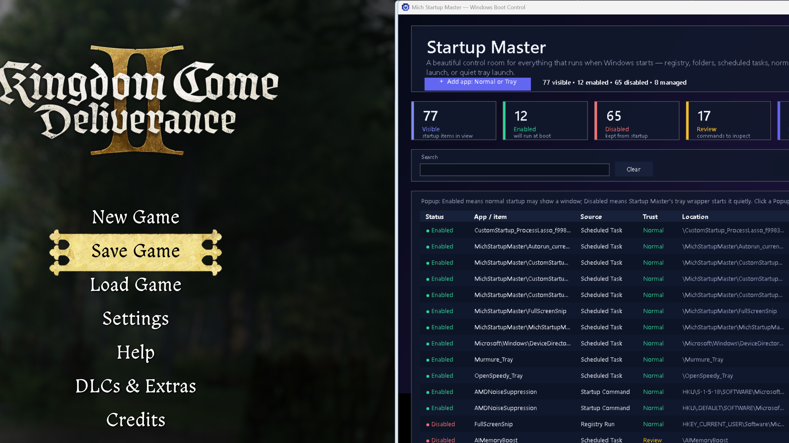
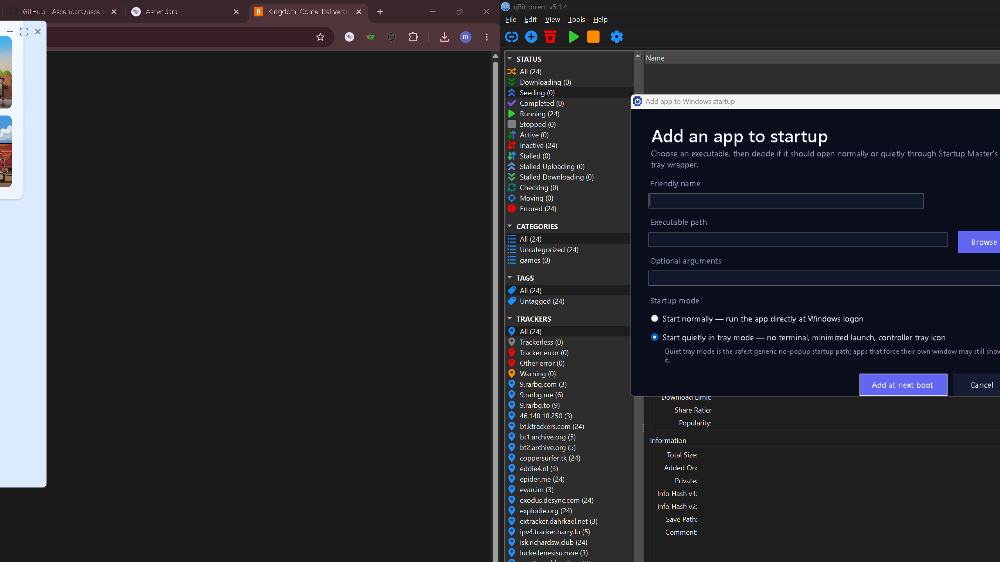

<div align="center">

# 🚀 Mich Startup Master

**Take full control of everything that starts with Windows.**

A native **Windows 11** startup manager with a dark dashboard UI, a self-repairing boot agent,
quiet tray-launch mode, instant new-startup alerts, and a built-in audit that **proves** every
boot source is visible and every tray app runs exactly once.

[](#)
[](#)
[](#)
[](#)
[](#-install)
[](#license)

</div>

---

## 📦 Download & install

Two ways to get it:

| Option | What you get |
|---|---|
| **`MichStartupMaster-Setup.exe`** (recommended) | A proper Windows installer — Start Menu shortcut, uninstaller, icon. Installs per-user, **no administrator rights needed**. |
| **Portable `MichStartupMaster.exe`** | The fully self-contained executable (no .NET install required) — run it from anywhere. |

> Get the latest installer from the **[Releases](https://github.com/Michaelunkai/mich-startup-master/releases)** page.
> The installer installs to `%LOCALAPPDATA%\Programs\MichStartupMaster` and starts the hidden agent on first run.

---

## ✨ Highlights

- **One place for every startup source** — registry `Run`/`RunOnce`/`RunServices`, policy runs,
  Startup folders, logon & boot scheduled tasks, auto services, boot/system/auto drivers,
  Winlogon autostart, Active Setup, AppInit DLLs, and disabled-item metadata.
- **Never miss anything** — a watcher scans every boot source and **pops a notification next to
  the tray icon the moment a new startup entry appears** — whether it was added by this app,
  another app, an installer, or a registry edit. The list refreshes instantly.
- **Add in one step** — paste a full path (or an entire command line) and the friendly name,
  arguments, and quiet mode are filled in automatically. No browsing required.
- **Start quietly in the tray** — launch any app hidden at logon with **its own real tray icon**
  (never a duplicate or broken wrapper icon), and pop its window open only when you want to.
- **Guaranteed to run at every boot** — a hidden agent re-asserts your enabled list every 30 s,
  recreating deleted tasks, re-enabling disabled ones, and launching anything it repairs right away.
- **Disable that actually sticks** — quiet apps included. A hung `schtasks` can never freeze the
  UI or silently re-enable an item you turned off.
- **Provable coverage** — the built-in **Coverage** check (`--audit-boot`) verifies
  `gaps=0` (every boot source is shown) and `findings=0` (no duplicate tray icons / wrapper icons).
- **One row per app** — duplicate launchers, WMI mirrors, and stale records are collapsed, while
  legacy items you once configured stay visible as **Legacy v2** rows you can restore.

---

## 📸 Screenshots

| Main dashboard | Add / edit dialog |
|---|---|
|  |  |

More captures: [full list](artifacts/proof/MichStartupMaster_monitor2_full_list.png) ·
[foreground](artifacts/proof/MichStartupMaster_foreground.png) ·
[running](artifacts/proof/MichStartupMaster_running.png)

---

## 🚦 Quick start

```powershell
# Run the app (opens the dashboard)
.\build\MichStartupMaster.exe

# Or install it properly with the installer
.\dist\MichStartupMaster-Setup.exe

# Rebuild from source
.\scripts\build.ps1

# Run the full regression suite
.\scripts\test.ps1
```

> Requires Windows 11. Building needs a working .NET SDK 10; the build script automatically
> prefers the project-local `.dotnet\` SDK when the system SDK is incomplete.

---

## 🖥️ Using the app

### The dashboard

- **Metric cards** show visible / enabled / disabled / needs-review / managed counts at a glance.
- **Search** and quick filters: All · High risk · Suggested cleanup · Disabled.
- **Columns**: Application · Startup entry · Source · Risk · Cleanup · Popup · Location · Launch command.
- **Right-click any row** for edit, remove, restore, make quiet, launch now, open location, copy command, refresh.
- **Keyboard**: `Ctrl+N` add · `Enter` edit · `Delete` remove · `F5` refresh · `Ctrl+L` launch now ·
  `Ctrl+O` open location · `Ctrl+C` copy command · `Esc` clear search.
- **Coverage** button runs the built-in boot + tray audit and shows the result inline.
- Closing the window hides the app to its own tray icon; it keeps guarding your startup list.

### Adding an app

Paste a **full path** (or an entire command line like `"C:\Tools\app.exe" --flag`) into the smart
paste field — the friendly name (read from the file's metadata), arguments, and quiet mode are
auto-filled. Then pick one of two modes:

| Mode | What happens at logon |
|---|---|
| **Start normally** | Runs the executable directly — no Task Scheduler delay. |
| **Start quietly in tray mode** | Launches hidden via the quiet wrapper; the app draws **its own** tray icon; the wrapper stays invisible and exits when the app exits. |

Supports `.exe`, `.cmd`, `.bat`, `.ps1`, and `.lnk` targets (`.ps1`/`.cmd` are routed through the
correct Windows host so they never flash a console). Packaged (MSIX/Store) app paths are
auto-resolved to the newest installed version when the app has updated.

### CLI reference

| Command | Purpose |
|---|---|
| `--list` | JSON inventory of every startup item |
| `--audit-boot` | Boot-coverage (`gaps=0`) + tray-coverage (`findings=0`) self-check |
| `--detect-new` | Report any startup entries that appeared since the last scan |
| `--list-managed` | JSON of the enabled-manifest rows |
| `--set-enabled <name> <true\|false>` | Enable / disable an entry (registry, task, folder, service, driver) |
| `--toggle-popup <task> <normal\|tray>` | Switch a managed task between popup and quiet-tray mode |
| `--enforce-enabled` | Re-assert every enabled item now (recreate / re-enable / fix delay) |
| `--enforce-disabled` | Re-assert every protected-disabled item now |
| `--enforce-quiet` | Restore quiet wrapper actions on protected tray tasks |
| `--protect-disabled` | Record current disabled state into the protection store |
| `--add-startup <name> <path> [args] [normal\|tray]` | Add a managed startup entry |
| `--ui-contract` | Machine-readable UI contract for automation/testing |
| `--smoke` | Self-test smoke mode |
| `--agent` / `--start-in-tray` | Start the hidden guarding agent in the tray |

---

## 🛡️ How it works

### The guard agent

A hidden `--agent` process (registered at two redundant boot paths: a Startup-folder shortcut
**and** the managed logon task `\MichStartupMaster\MichStartupMasterApp`) wakes every 30 seconds
and enforces the authoritative stores:

| Store | File (`%LOCALAPPDATA%\MichStartupMaster\`) | Guard |
|---|---|---|
| Enabled manifest | `enabled-startup-items.tsv` | re-creates deleted tasks, re-enables disabled ones, removes delays, launches repaired items immediately |
| Disabled protection | `protected-disabled-items.tsv` | keeps disabled items off, even if another tool re-enables them |
| Quiet protection | `protected-quiet-popup-items.tsv` | restores `--tray-run` wrapper actions if a task is switched back to a popup |
| Known inventory | `known-startup-items.tsv` | baseline for the **new-startup detection** watcher |

### New-startup detection

On every guard cycle the app diffs the full inventory against `known-startup-items.tsv`. The
first scan only seeds the baseline (no noise); after that, any genuinely new entry — a fresh
registry `Run` value, a new scheduled task, a dropped Startup-folder shortcut — triggers a tray
notification and an immediate list refresh. `--detect-new` exposes the same check for scripting,
and the regression suite asserts it with an isolated store.

### Why duplicates and broken icons are gone

- The quiet wrapper **never creates its own tray icon** — each app shows only its own real icon.
- The wrapper is single-instance per target: if the app is already running when a task fires, the
  wrapper quietly exits instead of launching a second copy.
- The wrapper starts the app fully hidden and keeps suppressing stray windows through the boot
  settle window, then only hides *new* windows — so clicking an app's own tray icon still opens it.
- Retired duplicate launchers (e.g. a legacy root task next to a managed one) are disabled by the
  guard and hidden behind their managed row.
- Disabling a quiet app removes its quiet-protection entry, so the guard can never resurrect it.
- The **Coverage** check re-proves all of this on demand — `BOOT_AUDIT … gaps=0` and
  `TRAY_AUDIT … findings=0` are asserted in `scripts/test.ps1` on every run.

### Migration from the old v2 app

Legacy v2 enabled items are adopted automatically (one-shot): they become managed tasks — tray
mode for items that ran quietly before, normal mode otherwise — while duplicate registry sources
are removed and duplicate legacy launchers disabled. Items only present in the old state appear as
**Legacy v2** rows and can be **Restore**d at any time.

---

## 🔨 Building from source

```powershell
.\scripts\build.ps1
```

The script:

1. Picks a working .NET SDK (prefers the project-local `.dotnet\`, then a Codex/repair SDK, then `dotnet`).
2. Publishes self-contained for `win-x64` (`dotnet publish -c Release -r win-x64 --self-contained true`).
3. Copies the icon + hidden VBS launcher into the output.
4. Verifies the built EXE actually carries an embedded icon.

Output: `build\MichStartupMaster.exe` (fully self-contained — no runtime install needed on the target PC).

### Building the installer

```powershell
& "C:\Program Files (x86)\Inno Setup 6\ISCC.exe" installer\MichStartupMaster.iss
```

Output: `dist\MichStartupMaster-Setup.exe` — a per-user installer (no admin required) that
installs to `%LOCALAPPDATA%\Programs\MichStartupMaster`, creates Start Menu shortcuts, and
registers an uninstaller.

Project: `MichStartupMaster.csproj` — .NET 10, WinForms, `System.Management`.

---

## 🧪 Testing

```powershell
.\scripts\test.ps1
```

The suite verifies, among other things:

- Smoke mode and a real startup inventory (`--list` returns many items across all sources).
- Known entries are present and every row has a human-readable `appName`.
- Service/driver toggle works on a disposable auto-start service (create → disable → enable → delete).
- High-risk drivers are marked red; normal user apps are never falsely marked.
- Tray and normal logon tasks are created without any `<Delay>` element.
- Quiet popup protection restores a tampered task back to `--tray-run …`.
- **New-startup detection** reports a freshly added registry value and clears it after removal.
- Arbitrary `.exe` / `.ps1` / `.cmd` targets route through the correct host.
- **Boot coverage** asserts `gaps=0`; **tray coverage** asserts `findings=0`.

---

## 📁 Project layout

```
MichStartupMaster.csproj       .NET 10 WinForms project
src/MichStartupMaster.cs       All source (CLI, services, guards, WinForms UI, tray runner, watcher)
assets/MichStartupMaster.ico   Native app / taskbar icon
build/MichStartupMaster.exe    Compiled self-contained app (archived)
installer/MichStartupMaster.iss  Inno Setup installer script
dist/MichStartupMaster-Setup.exe  Built installer (uploaded to Releases)
scripts/build.ps1              Reproducible build
scripts/test.ps1               Smoke + regression suite
scripts/open-on-monitor2.ps1   Open the GUI on the second monitor
artifacts/proof/               Screenshots captured during verification
```

---

## 🛠️ Troubleshooting

- **Old taskbar icon after pinning** — Windows caches pinned icons; unpin/re-pin the rebuilt EXE or restart Explorer.
- **Only one startup item shows** — run `scripts/test.ps1`; the fixed build reports the machine's full inventory.
- **Can't disable a system task / service / driver** — run the app elevated; Windows requires admin for those controls.
- **A quiet app still opens a window** — that app forces its own UI; use its own minimized/tray flags if it has any.
- **An item comes back after you disable it** — run `--enforce-disabled` and check the disabled-protection store; the guard keeps it off.
- **The Coverage button reports a gap** — run `MichStartupMaster.exe --audit-boot` and paste the output; every boot source must be represented.
- **A new app isn't showing up** — wait up to 30 s for the guard cycle, or click **Refresh inventory**; the tray toast fires the moment it's detected.

---

## 📄 License

[MIT](LICENSE) © Michael (Michaelunkai)

---

<div align="center">

**Mich Startup Master** — *everything that starts with Windows, finally under your control.*

</div>
